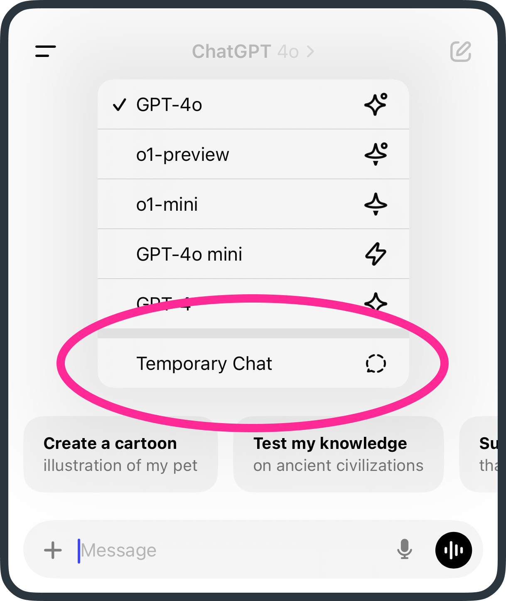

# Exploring deeper conversations (without getting too personal)

In the last couple of lessons, we covered how to write effective prompts, the value of follow-up questions, and how to use personal details for better results. These lessons have been very input-focused — today, we’re shifting focus to the **output**.

## Conversation starters 💬
While I’ve mentioned that AI is great when you have a **question**, it’s even better if you engage it before you even know what that question is.

```
Instead of waiting until you have a burning question, I encourage you to engage ChatGPT when you have the beginnings of a thought or a topic you want to explore more deeply.
```

I do this in my own life when I encounter topics that I don’t fully understand or have a strong opinion about (yet). Here are some of my own recent musings:

- I’m really interested in the idea that previous generations didn’t have many photographs to document their lives, compared to my kids who have tens of thousands of pictures
- It feels like US culture is very preoccupied with identity politics vs what I see in Australia
- My son’s 8 year old friend has unfettered access to YouTube. This can’t be good?

Engaging AI with half-formed thoughts can be incredibly useful for helping you develop a better understanding and form your own opinions. Using what we’ve learned about follow-up questions — this is the perfect opportunity to ask “dumb” questions when diving into unfamiliar topics.

Often, you'll find that AI responds by asking thought-provoking questions or by steering the conversation in unexpected but enlightening directions💡

## But first, privacy 🔒
In the last lesson, we talked about adding personal details to enrich responses. However, you may not always want to openly discuss certain topics "on the record." For situations like these, we have **Temporary Chats**.



Pressing the `ChatGPT 4o` title in the app, you can choose the Temporary Chat option which will start a new chat, but will not save your conversation to the sidebar or to 3rd party analysis. You don’t need to use this, but it’s here if you need peace of mind.

## Challenge your opinion 🤯
Today’s task is to discuss a recent court case. The best way to start is to provide the AI with enough context to give a meaningful response. A good beginning might be:

> I am a {job role} for a {entity type} in {country}. I deal with {case types}. I'd like to discuss a recent case

If you’re not comfortable, you can just use a case you heard about in the news. From here, you can take the conversation in various directions, but I suggest using AI to **challenge your perspective**. Once you’ve initiated the discussion, a good follow-up might be:

> Provide two opposing arguments

Or even:

> Help me understand the perspective of the defendant

Maybe even

> What would the wrong verdict look like?

***

Ultimately, AI cannot (and should not) provide legal or professional advice, but what it excels at is helping you solidify your own position by exploring different viewpoints.

As a lighthearted end, you could ask AI what perspective David Attenborough might have had on the case — just for fun. 🐒🎙️