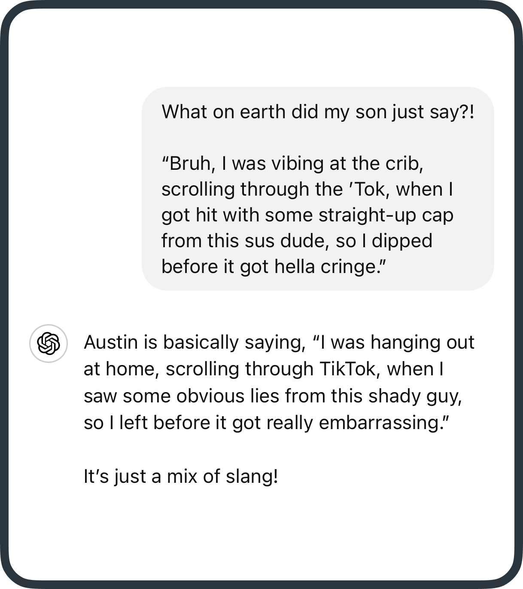

# Not your average essay
Most discussions about AI focus on its writing capabilities — creating, shortening, translating, or summarizing content. Sure, AI excels at that, but that’s definitely not its most exciting feature 🥱

You **can** ask AI to whip up a poem about geese, write an essay on nuclear fusion, or even generate code for an app. But, let’s face it, you probably don’t need any of that. And even if you did, relying on AI for all your original content isn’t a habit you want to form.

But there **is** one area of writing where AI could really help you — emails 📧 and messages 💬. Today, we’ll explore prompts to help you manage your communications without making AI do all the heavy lifting!

## The long message dilemma
Ever received a lengthy document, a wordy email, or a rambling message you need to reply to? For those moments, try this prompt:

> Summarize this into bullet points: {insert long message}

Once you’ve written your reply, ensure you’ve covered everything with this:

> Here’s my reply — have I addressed all the points? {insert your reply}

## Voice and tone
If you’re unsure whether your message strikes the right tone, AI can help adjust it to match the vibe you’re going for. Try:

- Make this more formal
- Make this more fun and friendly
- Help me sound authoritative but not bossy
- Make this engaging for a 15 year old

And if you’re communicating with someone from a different generation, you can even use AI as your personal translator:

## Emoji
If your emoji game could use a boost, AI has your back! Just ask: “Add emojis to this message: {insert your message}”

## Get a second opinion
AI isn’t just for writing—it can also analyze your content, offering feedback and constructive criticism when you need it. For instance:

- **🤔 Perception:** What level of subject matter expertise does the author (that’s you!) demonstrate?
- **✍️ Response:** What tough questions could someone ask in response to this?
- **⭐ Quality:** What’s the weakest part of this argument/pitch/idea?

***

## Instagram
Alright, there are **some** instances where writing original content isn’t a huge priority — like Instagram captions. If you’re not feeling creative, upload a pic and try:

> 🖼 Create an Instagram caption for this photo that’ll get lots of likes and shares

❤️